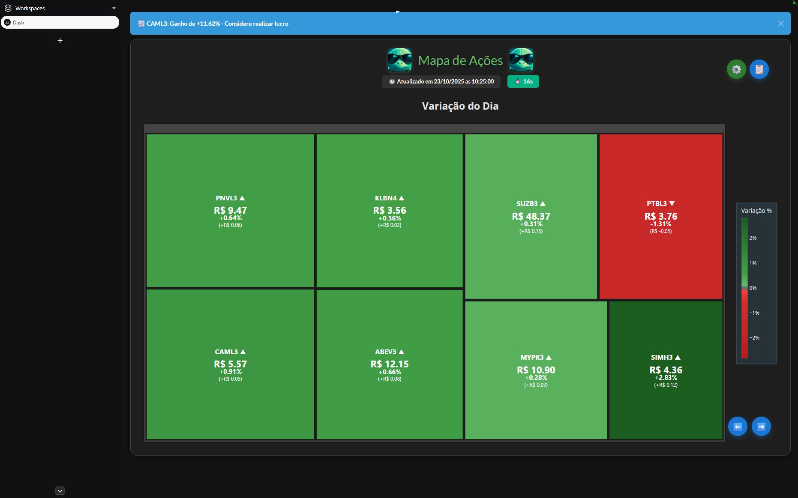

<div align="center">

# B3 Portfolio Dashboard

**Interactive self-hosted dashboard for tracking a B3 stock portfolio.**


</div>

---

Dashboard interativo para acompanhar carteira de acoes da B3 em treemaps dinamicos. Projeto pessoal, self-hosted, 100% gratuito.



## Funcionalidades

- **Treemap com 3 visualizacoes:** variacao do dia, 7 dias e ganho/perda total
- **Rotacao automatica** entre telas com tempos configuraveis
- **Graficos historicos** de 30 dias ao clicar em qualquer acao
- **Alertas** para mudancas bruscas, oportunidades e realizacao de lucro
- **Gerenciamento** de acoes via interface web
- **Atualizacao** automatica a cada 5 minutos via Yahoo Finance

## Quick Start

```bash
git clone https://github.com/cascodigital/b3-portfolio-dashboard.git
cd b3-portfolio-dashboard
docker compose up -d
# Acesse http://localhost:8050
```

## Configuracao

Adicione acoes pela interface (botao de configuracoes) ou edite `acoes.csv`:

```csv
ticker,shares,avg_price
PETR4.SA,100,25.50
VALE3.SA,200,70.30
```

Tickers da B3 usam sufixo `.SA` (preenchido automaticamente pela GUI).

## Stack

- [Plotly Dash](https://dash.plotly.com/) + [Dash Bootstrap](https://dash-bootstrap-components.opensource.faculty.ai/)
- [yfinance](https://github.com/ranaroussi/yfinance) (dados com ~15min de atraso)
- Docker com volume persistente e restart automatico

## Avisos

Projeto pessoal para uso privado. Sem autenticacao ou protecao para exposicao publica. Use com tunnel (Cloudflare, Tailscale) ou em rede local.

---

Desenvolvido com 🐢 (e cafe) por **Casco Digital**.
