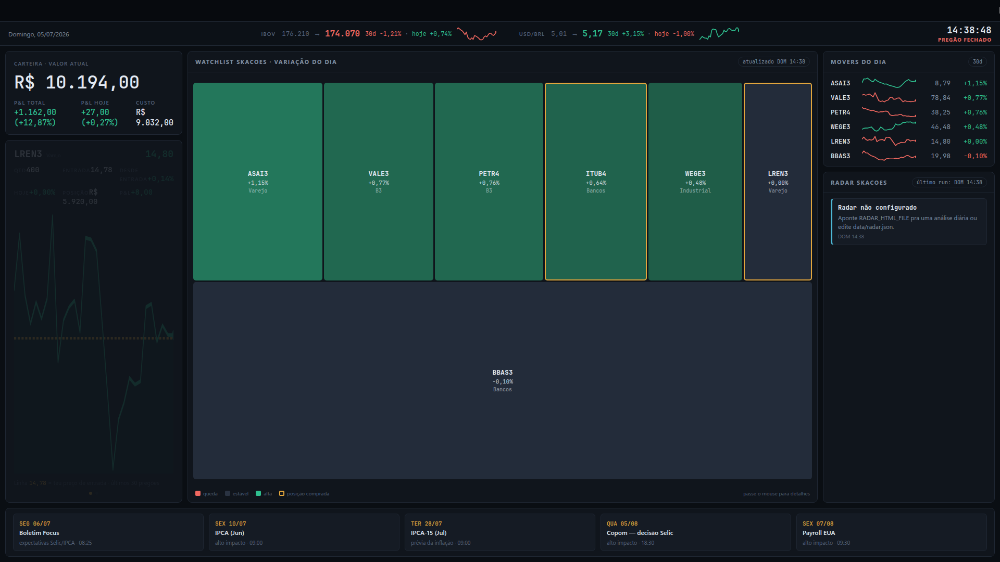

# 📈 Painel de Ações B3 — Dashboard 1080p pra TV / Home Assistant

Dashboard dark de carteira B3 pensado pra ficar aberto numa tela dedicada (TV, kiosk, painel do Home Assistant): treemap da watchlist, carrossel de posições com P&L real, IBOV/USDBRL com sparkline, radar de análise diária e agenda econômica.

É a evolução do antigo visualizador Dash/Plotly deste repo — agora **zero dependências**: um script Python (só stdlib) gera um **HTML auto-contido** a partir de um template. Sem servidor, sem pip install, sem container.



## Quickstart (60 segundos)

```bash
git clone https://github.com/cascodigital/b3-portfolio-dashboard
cd b3-portfolio-dashboard

# 1. sua carteira: edite data/carteira.json (ticker, qtd, preço de entrada)
# 2. sua watchlist: edite data/acoes.txt (um ticker B3 por linha)

python3 build.py --no-push
xdg-open painel-acoes.html   # ou só abra o arquivo no browser
```

Só isso. Requisito único: Python 3.9+. Tudo abaixo desta linha é **opcional** — automação, publicação numa TV e integrações.

## Como funciona

```
data/acoes.txt        watchlist (tickers B3)
data/carteira.json    posições reais (qtd + preço de entrada)
events.json           eventos datados (Copom, IPCA, earnings)
template.html         visual — HTML/CSS/JS com placeholders
        │
        ▼
build.py  ──►  busca cotações (Yahoo Finance, sem token)
              calcula agenda (Focus toda segunda, Payroll 1ª sexta)
              splice no template  ──►  painel-acoes.html
              (opcional) push via SSH pro Home Assistant
```

O HTML final é estático e auto-contido — relógio e status de pregão rodam em JS ao vivo; cotações mudam a cada build. A página **se recarrega sozinha a cada 5 minutos** pra pegar o build mais novo do servidor — essencial em TV/kiosk, onde ninguém aperta F5. Com o timer de 15 min, a latência máxima entre editar a carteira e ver na tela é ~20 min.

## Carteira (`data/carteira.json`)

```json
{
  "atualizado": "2026-07-07",
  "posicoes": [
    {"ticker": "PETR4", "qtd": 200, "preco_entrada": 38.50}
  ],
  "historico_vendas": [
    {"ticker": "BBAS3", "qtd": 300, "preco_entrada": 26.10, "preco_saida": 27.45,
     "data_venda": "2026-06-15", "obs": "alvo atingido"}
  ]
}
```

- `posicoes` — o que você tem agora; alimenta o carrossel de posição, o P&L e a borda âmbar no treemap. Ticker **sem** sufixo `.SA`. Ticker comprado fora da watchlist também é buscado.
- `historico_vendas` — trades encerrados. O painel ainda não exibe (é o dado bruto pra um futuro bloco de P&L realizado), mas registre `preco_saida` sempre: sem ele o resultado do trade fica irrecuperável.
- **Carteira vazia é suportada**: com `posicoes: []` o painel mostra "sem posição aberta · carteira 100% em caixa" e P&L "—" (nada de NaN nem tela quebrada).

## Opcionais

### Publicar no Home Assistant

O build pode empurrar o HTML pro `www/` do HA via SSH (chave, sem senha):

```bash
export PAINEL_SSH_DEST=root@homeassistant
export PAINEL_SSH_PORT=22
export PAINEL_SSH_PATH=/config/www/painel-acoes.html
python3 build.py
```

No HA, crie uma view `type: panel` com um card `iframe` apontando pra `/local/painel-acoes.html` (sem `aspect_ratio` — ele preenche a tela sozinho). Numa TV, o addon HAOS Kiosk abre a URL direto.

### Agendamento (systemd user timer)

Exemplos em `systemd/`: roda a cada 15 min durante o pregão (seg–sex 10h–17h45) + snapshot às 18:05.

```bash
cp systemd/painel-acoes.* ~/.config/systemd/user/
systemctl --user daemon-reload
systemctl --user enable --now painel-acoes.timer
```

### Radar (opcional)

O quadro "radar" exibe picks de uma análise diária externa. Se você tem algum job que gera um HTML de análise, aponte `RADAR_HTML_FILE` pra ele e adapte `parse_radar()` ao seu formato — ou simplesmente edite `data/radar.json` na mão:

```json
{"generatedAt": "2026-07-05T15:45", "items": [
  {"t": "LREN3", "kind": "buy", "title": "1º — COMPRA", "body": "R$ 15,20 · Alvo +6% · Stop -3%"}
]}
```

`kind`: `buy` (verde), `warn` (âmbar), `info` (neutro). Sem radar configurado, o quadro mostra um aviso e o painel funciona normal.

## Arquivos

```
build.py          gerador (stdlib only)
template.html     visual — edite aqui pra mudar o layout
events.json       eventos datados; Focus/Payroll são calculados
data/             watchlist + carteira (exemplos incluídos)
systemd/          service + timer de exemplo
```

## Guardrails

- Se mais da metade das cotações falhar, o build **aborta** sem sobrescrever o painel anterior.
- Posição sem cotação disponível também aborta.
- Radar indisponível cai pro cache (`data/radar.json`) — o painel nunca quebra, só fica velho.
- Sem chamadas de IA, sem API paga, sem token: o ciclo inteiro é Yahoo Finance público + arquivos locais.

## ⚠️ Disclaimer

Projeto pessoal de hobby, pra uso privado (rede interna / túnel autenticado). Não há autenticação nem hardening pra exposição pública. Não é recomendação de investimento.

## 📝 Licença

MIT.
