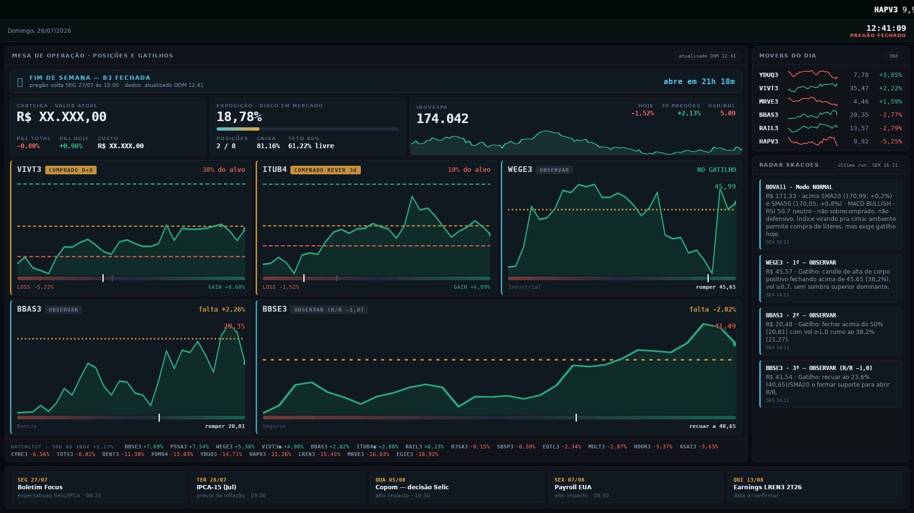

# 📈 Painel de Ações B3 — Dashboard 1080p pra TV / Home Assistant

Dashboard dark de carteira B3 pensado pra ficar aberto numa tela dedicada (TV, kiosk, painel do Home Assistant). A tela mostra só o que exige decisão: um **cockpit** com carteira, exposição contra o teto da estratégia e o índice em 120 pregões; uma **mesa de operação** com um card por posição ou candidata, cada uma com 30 pregões e os níveis de OCO desenhados; radar de análise diária e agenda econômica. A watchlist inteira fica numa faixa de texto no rodapé, ordenada por força relativa contra o índice — acompanhamento não ocupa espaço de decisão.

É a evolução do antigo visualizador Dash/Plotly deste repo — agora **zero dependências**: um script Python (só stdlib) gera um **HTML auto-contido** a partir de um template. Sem servidor, sem pip install, sem container.



## Quickstart (60 segundos)

```bash
git clone https://github.com/cascodigital/b3-portfolio-dashboard
cd b3-portfolio-dashboard

# 1. sua carteira: edite data/carteira.json (ticker, qtd, preço de entrada)
# 2. sua watchlist: edite data/acoes.txt (um ticker B3 por linha)

python3 build.py --no-push
xdg-open painel-acoes.html   # ou só abra o arquivo no browser
```

Só isso. Requisito único: Python 3.9+. Tudo abaixo desta linha é **opcional** — automação, publicação numa TV e integrações.

## Como funciona

```
data/acoes.txt        watchlist (tickers B3)
data/carteira.json    posições reais (qtd, entrada, OCO) + capital e caixa
events.json           eventos datados (Copom, IPCA, earnings)
template.html         visual — HTML/CSS/JS com placeholders
        │
        ▼
build.py  ──►  busca cotações (Yahoo Finance, sem token)
              calcula agenda (Focus toda segunda, Payroll 1ª sexta)
              splice no template  ──►  painel-acoes.html
              (opcional) push via SSH pro Home Assistant
```

O HTML final é estático e auto-contido — relógio e status de pregão rodam em JS ao vivo; cotações mudam a cada build. A página **se recarrega sozinha a cada 5 minutos** pra pegar o build mais novo do servidor — essencial em TV/kiosk, onde ninguém aperta F5. Com o timer de 15 min, a latência máxima entre editar a carteira e ver na tela é ~20 min.

## Carteira (`data/carteira.json`)

```json
{
  "atualizado": "2026-07-26",
  "capital_operacional": 50000.00,
  "caixa_operacional": 38500.00,
  "teto_posicoes": 8,
  "posicoes": [
    {"ticker": "PETR4", "qtd": 200, "preco_entrada": 38.50, "data_compra": "2026-07-20",
     "stop_loss": 36.58, "alvo": 41.58},
    {"ticker": "ABEV3", "lado": "short", "qtd": 100, "preco_entrada": 15.20,
     "data_compra": "2026-07-22", "stop_loss": 16.05, "alvo": 14.10}
  ],
  "historico_vendas": [
    {"ticker": "BBAS3", "qtd": 300, "preco_entrada": 26.10, "preco_saida": 27.45,
     "data_venda": "2026-06-15", "obs": "alvo atingido"}
  ]
}
```

- `posicoes` — posições abertas long e short; cada uma vira um card na mesa e entra no P&L e na exposição. `lado` ausente significa `long`; use `"lado": "short"` em venda a descoberto. No short, queda é lucro e alta é prejuízo. Ticker **sem** sufixo `.SA`; posição fora da watchlist também é buscada.
- **OCO dentro da posição** — `stop_loss` e `alvo` são campos numéricos do próprio objeto, então nascem e morrem com a posição: encerrou o trade, removeu o objeto, o OCO some junto. Não existe arquivo nem lista separada de OCO. Aliases aceitos: `stop`/`take_profit`. O formato legado com os níveis embutidos na string `obs` (`"OCO: stop R$36,58 / alvo R$41,58"`) continua sendo entendido, mas não use em registro novo — `obs` é texto livre.
- O card da posição desenha 30 pregões com alvo verde, entrada âmbar e stop vermelho, e uma barra de progresso **stop → alvo**: extremidade esquerda é o stop, direita é o alvo, traço branco é o preço agora, traço cinza é a entrada. O rótulo `N% do alvo` é a posição do traço branco nesse trajeto. Sem OCO, o card cai pra uma barra de desvio desde a entrada.
- `capital_operacional` e `caixa_operacional` alimentam o bloco de exposição do cockpit (posições a mercado sobre o capital, medido contra o teto de 80%). `teto_posicoes` (default 8) é só o denominador do contador `N / teto`. Ausentes, o bloco mostra `—`.
- `historico_vendas` — trades encerrados. O painel ainda não exibe (é o dado bruto pra um futuro bloco de P&L realizado), mas registre `preco_saida` sempre: sem ele o resultado do trade fica irrecuperável.
- **Carteira vazia é suportada**: com `posicoes: []` a mesa mostra só as candidatas do radar (ou um aviso de mesa vazia) e o P&L fica em "—" — nada de NaN nem tela quebrada.

## Opcionais

### Publicar no Home Assistant

O build pode empurrar o HTML pro `www/` do HA via SSH (chave, sem senha):

```bash
export PAINEL_SSH_DEST=root@homeassistant
export PAINEL_SSH_PORT=22
export PAINEL_SSH_PATH=/config/www/painel-acoes.html
python3 build.py
```

No HA, crie uma view `type: panel` com um card `iframe` apontando pra `/local/painel-acoes.html` (sem `aspect_ratio` — ele preenche a tela sozinho). Numa TV, o addon HAOS Kiosk abre a URL direto.

### Agendamento (systemd user timer)

Exemplos em `systemd/`: roda a cada 15 min durante o pregão (seg–sex 10h–17h45) + snapshot às 18:05.

```bash
cp systemd/painel-acoes.* ~/.config/systemd/user/
systemctl --user daemon-reload
systemctl --user enable --now painel-acoes.timer
```

### Radar (opcional)

O quadro "radar" exibe picks de uma análise diária externa. Se você tem algum job que gera um HTML de análise, aponte `RADAR_HTML_FILE` pra ele e adapte `parse_radar()` ao seu formato — ou simplesmente edite `data/radar.json` na mão:

```json
{"generatedAt": "2026-07-05T15:45", "items": [
  {"t": "LREN3", "kind": "buy", "title": "1º — COMPRA", "body": "R$ 15,20 · Alvo +6% · Stop -3%"}
]}
```

`kind`: `buy` (verde), `warn` (âmbar), `info` (neutro). Sem radar configurado, o quadro mostra um aviso e o painel funciona normal.

## Arquivos

```
build.py          gerador (stdlib only)
template.html     visual — edite aqui pra mudar o layout
events.json       eventos datados; Focus/Payroll são calculados
data/             watchlist + carteira (exemplos incluídos)
systemd/          service + timer de exemplo
```

## Guardrails

- Se mais da metade das cotações falhar, o build **aborta** sem sobrescrever o painel anterior.
- Posição sem cotação disponível também aborta.
- Radar indisponível cai pro cache (`data/radar.json`) — o painel nunca quebra, só fica velho.
- Sem chamadas de IA, sem API paga, sem token: o ciclo inteiro é Yahoo Finance público + arquivos locais.

## ⚠️ Disclaimer

Projeto pessoal de hobby, pra uso privado (rede interna / túnel autenticado). Não há autenticação nem hardening pra exposição pública. Não é recomendação de investimento.

## 📝 Licença

MIT.
